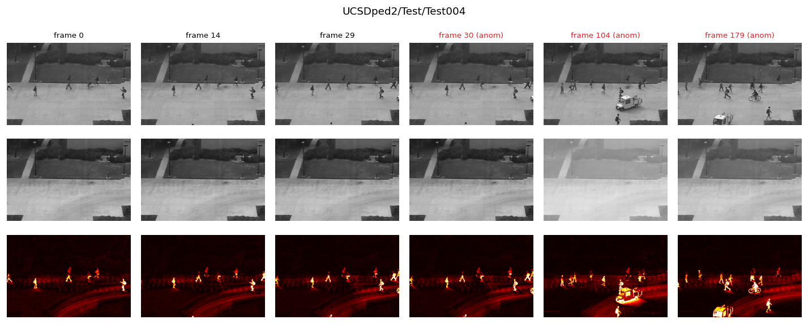
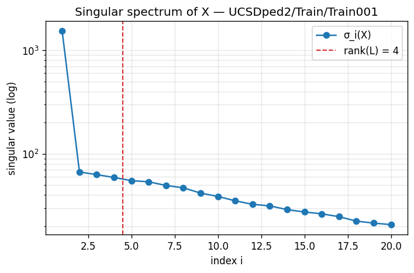
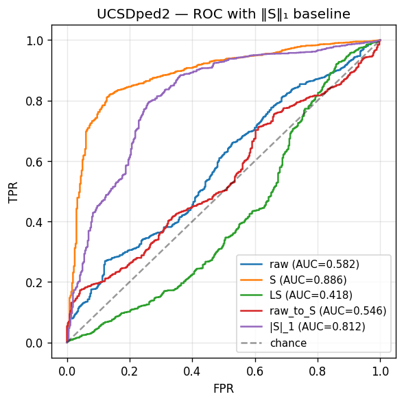
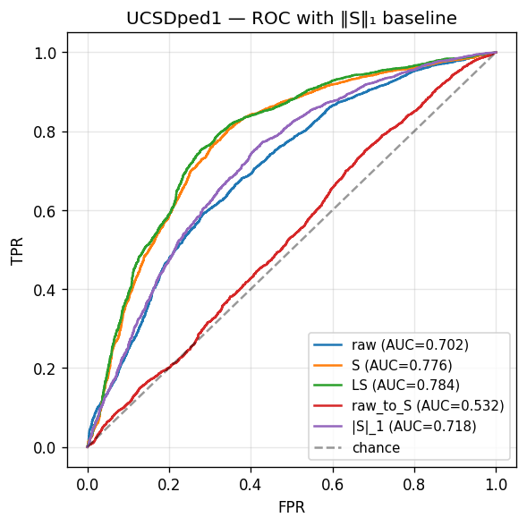
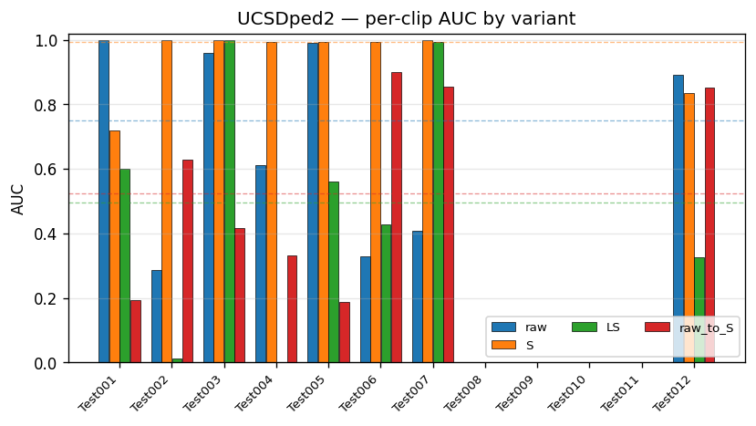
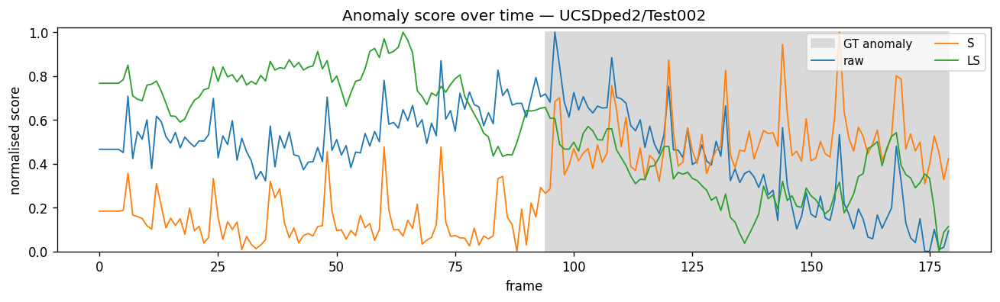
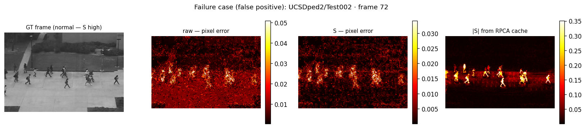
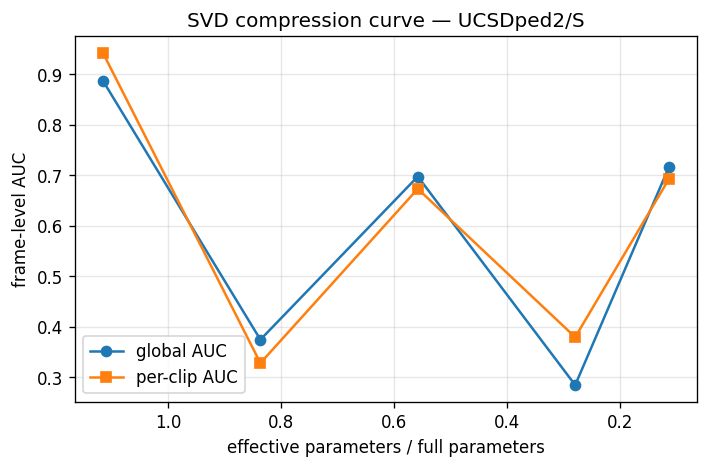

# RPCA-Enhanced Anomaly Detection on the UCSD Pedestrian Dataset

A case study in how two classical matrix-decomposition tools — **Robust PCA** and **SVD** — can be used to enhance, analyse, and compress a deep-learning anomaly-detection pipeline on the UCSD Ped1/Ped2 surveillance benchmark.

> **Author:** Martin Nordli Almenningen — Shanghai Jiao Tong University, Data Mining course project (May 2026).
> **Full report:** [`Data_Mining_RPCA_on_Pedestrian_Dataset_Report.pdf`](Data_Mining_RPCA_on_Pedestrian_Dataset_Report.pdf)



*RPCA cleanly separates the empty walkway (middle row, **L**) from moving content (bottom row, **|S|**) — including the vehicle in frames 30/104 and the cyclist in frame 179. This is the structural assumption the project is built on.*

---

## TL;DR

- **Headline gain.** A UNet future-frame predictor trained on RPCA's sparse component **S** reaches **0.886 AUC on Ped2** (vs. 0.582 on raw frames) and **0.783 AUC on Ped1** (vs. 0.702 on raw).
- **The twist.** A *non-learned* baseline — using only the per-frame `‖S_t‖₁` of RPCA's sparse component as an anomaly score — already reaches **0.812 (Ped2) / 0.718 (Ped1)**. Most of the apparent "deep-learning gain" lives in the representation, not the network.
- **Where the predictor helps.** It adds ≈7 percentage points on top of `‖S‖₁` on both datasets, by capturing *predictability* of motion in the S domain rather than just S energy.
- **Negative result on compression.** Naïve per-layer SVD truncation of the trained UNet's Conv2d weights produces a non-monotone AUC curve — finetuning would be required.

---

## 1. Background

Video anomaly detection identifies frames in surveillance footage that deviate from learned patterns of normal activity. UCSD Ped1/Ped2 is the canonical fixed-camera benchmark: normal frames contain only pedestrians, anomalies are non-pedestrian entities (cyclists, skateboarders, carts, vehicles).

| Property | Ped1 | Ped2 |
|---|---|---|
| Resolution | 158 × 238 | 240 × 360 |
| Train clips | 34 | 16 |
| Test clips | 36 | 12 |
| Camera angle | Approach with foreshortening | Side view, near-orthogonal |
| Crowd density | Dense | Sparse |

The problem reduces to separating *rare, transient deviations* from a *persistent, structured background*. That is precisely the model that **Robust PCA** (Candès et al. 2011) recovers:

$$X = L + S, \qquad \min_{L,S} \; \|L\|_* + \lambda \|S\|_1 \quad \text{s.t.} \quad X = L + S$$

Stacking a clip's frames as columns of $X \in \mathbb{R}^{(H\cdot W) \times T}$, the static walkway becomes the low-rank $L$ and moving content the sparse $S$. The singular spectrum confirms the assumption empirically — the first singular value is ~20× larger than the second on UCSDped2/Train001:



The inexact ALM solver (Lin et al. 2010) converges to tolerance $10^{-6}$ in ~12 iterations per clip, with the recovered rank of $L$ typically equal to **4**.

---

## 2. Research questions

| | |
|---|---|
| **RQ1** | Does RPCA preprocessing improve a UNet future-frame predictor over raw input on Ped1/Ped2? |
| **RQ2** | Which component carries the signal — **S**, **L**, or **[L, S]**? |
| **RQ3** | How do gains differ between Ped1 (dense, low-res) and Ped2 (sparse, higher-res)? |
| **RQ4** | Can SVD truncation of the trained network's weights compress it without finetuning? |
| **RQ-D** | *(diagnostic, added after results)* How much of the gain comes from the representation versus from the learned predictor? |

---

## 3. Method

### 3.1 Pipeline

```
clip frames ──► RPCA per clip ──► (L, S) cache ──► UNet predictor ──► per-frame anomaly score
                  (ALM solver)     (.npz, fp16)    (4-frame window)
```

RPCA is applied **per clip** rather than globally — each clip has its own static background. Hyperparameters follow the original papers: $\lambda = 1/\sqrt{\max(n_1, n_2)}$ and $\mu_0 = n_1 n_2 / (4\|X\|_1)$.

### 3.2 The four input/target variants

| Variant | Input | Target | RPCA acts on |
|---|---|---|---|
| `raw` | Raw frames | Raw frame | Nothing (baseline) |
| `S` | Sparse component | Sparse component | Both sides |
| `LS` | `[L, S]` concatenated | Raw frame | Input only |
| `raw_to_S` | Raw frames | Sparse component | Target only |

`raw_to_S` is the key ablation: it isolates whether the gain comes from a cleaner *input* or a cleaner *target*.

### 3.3 Model and training

- **Architecture:** UNet, `base_channels=32`, **4.49M parameters**, 4-frame input window, single-channel grayscale output.
- **Loss:** L2 reconstruction + gradient term ($\lambda_{\text{grad}} = 1.0$).
- **Optimizer:** Adam, lr $2\times 10^{-4}$, 3-epoch linear warmup, cosine decay.
- **Training:** batch size 16 (Ped2) / 32 (Ped1), up to 100 epochs, early stopping (patience 10).
- **Splits:** clip-level holdout (15 % Ped2, 10 % Ped1) — no clip is shared between train and val.

The same architecture, hyperparameters, and seed are used across all four variants. Only the input and target tensors change.

### 3.4 The `‖S‖₁` baseline

After the main results came in, we added one further measurement: the per-frame $\ell_1$ norm of the cached S component, $\|S_t\|_1$, used directly as an anomaly score with no model. This is an upper bound on what is achievable from the RPCA representation alone.

---

## 4. Results

### 4.1 Frame-level AUC

| Dataset | Variant | AUC (global) | AUC (per-clip) | EER |
|---|---|---:|---:|---:|
| Ped2 | raw | 0.582 | 0.685 | 0.454 |
| Ped2 | **S** | **0.886** | **0.942** | **0.164** |
| Ped2 | LS | 0.418 | 0.490 | 0.583 |
| Ped2 | raw_to_S | 0.546 | 0.546 | 0.498 |
| Ped2 | `‖S‖₁` (no model) | 0.812 | 0.813 | — |
| Ped1 | raw | 0.702 | 0.771 | 0.350 |
| Ped1 | S | 0.776 | 0.814 | 0.277 |
| Ped1 | **LS** | **0.783** | **0.824** | **0.266** |
| Ped1 | raw_to_S | 0.532 | 0.594 | 0.486 |
| Ped1 | `‖S‖₁` (no model) | 0.718 | 0.726 | — |

### 4.2 ROC curves




**Six observations:**

1. **RPCA representations beat raw on both datasets** — 30 AUC points on Ped2, 8 on Ped1.
2. **Most of the gain is in the representation.** On Ped2 the headline 30-pt gain decomposes as roughly +23 pp from the representation (`‖S‖₁` baseline) and +7 pp from the learned predictor.
3. **`raw_to_S` is the worst variant on both datasets.** The gain only materialises when S is the *input*, not the target.
4. **Best variant differs by dataset.** S wins on Ped2; LS marginally wins on Ped1.
5. **Score histograms confirm the AUC ranking.** The S-variant on Ped2 produces visibly separated normal/anomalous distributions; raw and LS heavily overlap.
6. **Per-clip AUC is revealing.** On Ped2, S reaches AUC ≈ 1.0 on five of eight measurable clips.

### 4.3 Per-clip detail and a representative timeline



*Test008–Test011 are 100 % anomalous and have undefined per-clip ROC (gaps in the chart).*



The S model's score steps up sharply at the anomaly onset and stays elevated; the raw model's score is dominated by motion-driven noise unrelated to the anomaly. (Test002 is the largest-gap example, not a representative one.)

### 4.4 Failure case



A normal frame on which the S model fires. The cached `|S|` panel shows this frame already has high S energy from a dense pedestrian cluster — a direct illustration of the predictor's confound with the representation: where `‖S‖` is high for non-anomalous reasons (many pedestrians), the model still fires.

### 4.5 SVD weight compression (RQ4)

Per-layer SVD truncation applied to every Conv2d weight of the trained Ped2/S UNet, with no finetuning:

| Rank fraction | Compression ratio | AUC (global) | AUC (per-clip) |
|---:|---:|---:|---:|
| 1.00 | 1.115 | 0.885 | 0.941 |
| 0.75 | 0.837 | 0.374 | 0.328 |
| 0.50 | 0.558 | 0.697 | 0.672 |
| 0.25 | 0.280 | 0.284 | 0.379 |
| 0.10 | 0.114 | 0.715 | 0.690 |



This is a **negative result for naïve compression**: the top singular directions of the trained Conv2d weights are not aligned with the discriminative directions of the network. A finetuning step after each truncation would almost certainly produce a smooth degradation curve; we leave that to future work.

---

## 5. Discussion — where the gain actually comes from

The most important finding: **most of the gain attributable to "RPCA preprocessing" is achievable without any learned model at all.** On Ped2, `‖S_t‖₁` alone reaches 0.812 AUC — within 7.4 pp of the best learned model and 23 pp above the raw-pixel baseline. On Ped1 the gap is even tighter.

This reframes the contribution: the dominant effect is that **RPCA's S-component is itself a competent anomaly detector on UCSD**, because the assumptions underlying RPCA (low-rank background, sparse anomalies in the pixel domain) are well-aligned with the structure of the data. The learned predictor refines this signal — it does not create it.

**Why the predictor helps anyway.** `‖S‖₁` measures aggregate energy per frame; the predictor measures *local prediction error*. A frame where pedestrians move predictably has low prediction error even if `‖S‖` is high; a cyclist deviating from the pedestrian-flow pattern has high error even if `‖S‖` is comparable. The predictor captures predictability of motion in the S domain, which is orthogonal to raw S energy.

**Why Ped2 gains more than Ped1.** The proposal predicted RPCA would help most where the signal-to-noise ratio is poorest (Ped1). The opposite was observed. The `‖S‖₁` baseline clarifies why: RPCA's modeling assumptions hold most cleanly when the scene is genuinely sparse. Ped2's empty-walkway normal frames contrast strongly with anomalous frames; Ped1's dense pedestrian crowds blur the contrast. **The gain scales with how cleanly the data matches the low-rank-plus-sparse assumption, not with absolute noise level.**

**Why LS collapses on Ped2.** L is essentially constant within a clip on Ped2, so it adds no per-frame predictive information but does add input dimensionality and an attractor for overfitting on a small training set (16 clips). On Ped1 (34 train clips), LS is competitive with S.

**Comparison to public benchmarks.** Mahadevan et al. 2010 (MDT): ~0.82/0.83 (Ped1/Ped2). Hasan et al. 2016 (Conv-AE): ~0.81/0.90. Recent SOTA: 0.95–0.97 on Ped2. Our 0.886 on Ped2 is in the early-deep-learning range; we do not claim SOTA, and our methodology is intentionally simpler. Notably, our **non-learned `‖S‖₁` baseline (0.812) is essentially tied with the original MDT benchmark** — obtained with no training and one classical decomposition per clip.

---

## 6. Repository layout

```
.
├── README.md                                   # this file
├── Data_Mining_RPCA_on_Pedestrian_Dataset_Report.pdf
├── Project_Description.md                      # original proposal
├── report.md                                   # markdown source of the report
├── requirements.txt
├── notebooks/
│   └── main.ipynb                              # end-to-end driver
├── scripts/
│   ├── build_notebook.py                       # regenerates main.ipynb
│   ├── setup.sh, env.sh
│   └── *.slurm                                 # cluster jobs
├── src/
│   ├── data.py                                 # UCSD loader + GT parser
│   ├── rpca.py                                 # inexact ALM solver
│   ├── cache.py                                # fp16 .npz caching of L, S
│   ├── dataset.py                              # 4-frame window dataset
│   ├── model.py                                # UNet predictor
│   ├── losses.py                               # L2 + gradient loss
│   ├── train.py                                # training loop, early stopping
│   ├── evaluate.py                             # AUC / per-clip / EER / ROC
│   ├── svd_compression.py                      # per-layer Conv2d truncation
│   └── viz.py                                  # all figures
├── results/                                    # AUC tables + figures (committed)
│   ├── auc_table_v2.{csv,md}
│   ├── svd_compression.csv
│   └── viz/                                    # PNG + PDF figures
├── UCSD_Anomaly_Dataset.v1p2/                  # raw data (gitignored)
├── cache/                                      # RPCA outputs (gitignored)
└── checkpoints/                                # trained weights (gitignored)
```

---

## 7. Setup and reproduction

```bash
python3 -m venv .venv
source .venv/bin/activate
pip install -r requirements.txt
```

Place the UCSD dataset under `UCSD_Anomaly_Dataset.v1p2/` (Ped1 + Ped2 TIFF clips and `.m` ground-truth files; available on Kaggle as `orvile/ucsd-anomaly-dataset`).

Then run the notebook end-to-end:

```bash
jupyter lab notebooks/main.ipynb
```

The notebook drives the full pipeline:
1. Sanity-check the loader and parse frame-level GT.
2. Decompose one clip and visualise `X / L / |S|`.
3. Pre-compute and cache RPCA decompositions for every clip into `cache/UCSDped{1,2}/{Train,Test}/<clip>.npz`.
4. Train one UNet per variant (`raw`, `S`, `LS`, `raw_to_S`).
5. Score test frames by reconstruction error; report frame-level AUC / per-clip AUC / EER / ROC into `results/`.
6. Run the SVD weight-compression sweep on the trained Ped2/S model.

The notebook is regenerated from a script:

```bash
python3 scripts/build_notebook.py
```

### Hardware notes

Tuned for an M4 MacBook Pro (10-core, 16 GB):

- Training runs on **MPS** via PyTorch (`device='mps'`).
- RPCA runs on **CPU NumPy** with randomised SVD (Apple Accelerate BLAS is fast at these matrix sizes).
- RPCA caches store `L`, `S` as **float16** to halve disk usage.
- Per-clip independent decomposition keeps memory well under 1 GB.

End-to-end runtime on M4: ~3 minutes for all RPCA caches, ~10 minutes per training run, four runs per dataset → roughly **1.5 hours** for the full Ped1+Ped2 sweep.

---

## 8. Limitations

- **No temporal model.** A 4-frame window with no recurrence; recent SOTA uses ConvLSTM or transformer temporal modules.
- **Single seed per variant.** Differences below ~2 AUC points should not be considered significant without multi-seed reproduction.
- **Single architecture.** All conclusions are conditioned on a UNet predictor.
- **Per-clip AUC on Ped2 excludes 4 clips.** Test008–Test011 are 100 % anomalous → per-clip ROC undefined.
- **SVD compression without finetuning.** A fairer evaluation would finetune at each truncation level.

---

## 9. Future work

The diagnostic finding that `‖S‖₁` already reaches 0.812 on Ped2 motivates a follow-up study on **parameter efficiency**: train predictors of varying capacity (0.1M, 1M, 5M, 20M params) with and without RPCA preprocessing, and compare AUC vs. parameter count. The hypothesis is that the RPCA-preprocessed curve sits above the raw curve at small capacities and the two converge as capacity grows — i.e. RPCA acts as an inductive bias that substitutes for some model capacity. If observed, this would frame RPCA as a path to similar performance at substantially lower compute cost — relevant for surveillance video deployment on edge hardware.

---

## References

- Candès, E. J., Li, X., Ma, Y., & Wright, J. (2011). Robust principal component analysis? *Journal of the ACM*, 58(3), 1–37.
- Hasan, M., Choi, J., Neumann, J., Roy-Chowdhury, A. K., & Davis, L. S. (2016). Learning temporal regularity in video sequences. *CVPR*.
- Lin, Z., Chen, M., & Ma, Y. (2010). The augmented Lagrange multiplier method for exact recovery of corrupted low-rank matrices. *arXiv:1009.5055*.
- Mahadevan, V., Li, W., Bhalodia, V., & Vasconcelos, N. (2010). Anomaly detection in crowded scenes. *CVPR*.
